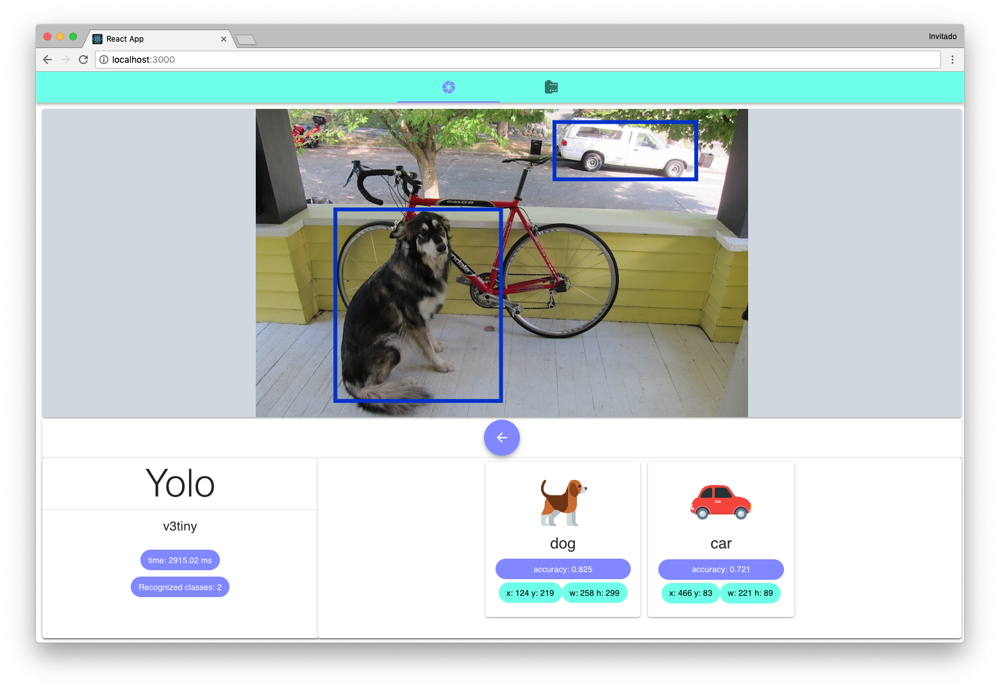

<h1 align="center">
   
  
</h1>

<h4 align="center">
  Implementation of YOLO (You Only Look Once) computer Vision algorithm
  and a React UI, for the subject Intelligent Systems at <a href="http://www.ull.es" target="_blank">ULL</a>.
</h4>

  
  
  

  <a href="#description">Description</a> •
  <a href="#usage">Usage</a> •
  <a href="#authors">Authors</a>

## Description
The aim of this project is to implement an iterface for the
YOLO (You Only Look Once) algorithm just in the browser.

Yolo algoritm is an *state of the art* procedure based on
convolutional neural networks for detecting the objets in
an scene, focusing in **real time**.

Implementation is done for acedemic purposes, for the subject
intelligent systems at the Computer Engeneering course of
La Laguna University ([ULL](www.ull.es)).

## Usage

We created a web application, build with React. We tested on
Safari and Chrome and you can check it in this link:

<h3 align="center">
  <a href="https://cristianabrante.github.io/YOLO-in-browser/">
    YOLO in Browser (hosted on Github Pages)
  </a>
</h3>

## Authors

* **Cristian Abrante Dorta** - [CristianAbrante](https://github.com/CristianAbrante)
* **Alberto Jesús González Álvarez** - [AlberTJ97](https://github.com/AlberTJ97)
