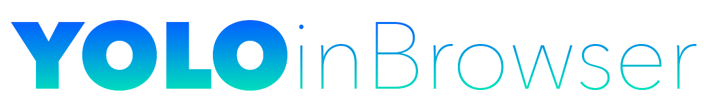

<h1 align="center">
   
  
</h1>

<h4 align="center">
  Implementation of YOLO (You Only Look Once) computer Vision algorithm
  and a React UI, for the subject Intelligent Systems at <a href="http://www.ull.es" target="_blank">ULL</a>.
</h4>

  
  
  

